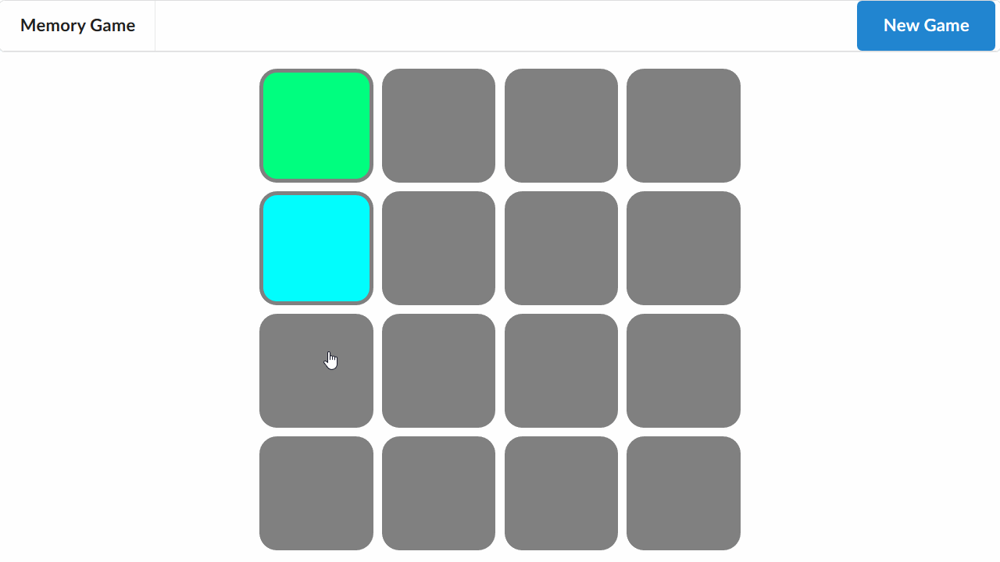

# [Memory Game](https://kristopherborel.me/memory-game/)



## Built with

- React
- Redux
- styled-components

## Run the project locally

**1.** Clone the project:

```
$ git clone https://github.com/kborel/memory-game.git
$ cd memory-game
```

**2.** Install dependencies:

```
$ npm install
```

**3.** Run:

```
$ npm start
```
